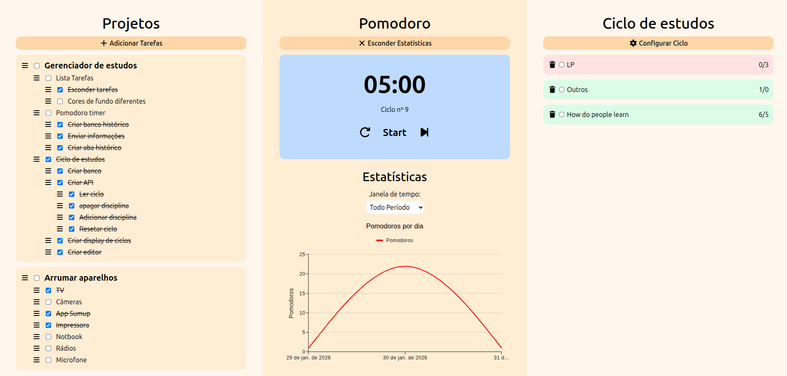

# Gerenciador de estudos
Essa web app foi feito para uso pessoal e para o aprendizado de ferramentas como **React Js, Tailwind CSS e Flask**. Ele contém três partes principais:
- **Projetos:** Essa aba ajuda no gerenciamento de projetos e tarefas. Nele você pode criar projetos, e após isso criar tarefas e subtarefas dentro de seus projetos, ajudando a quebrar essas tarefas em partes menores e mais fáceis de completar;

- **Timer Pomodoro:** Nessa aba temos um timer usado pelo método Pomodoro, ele estabelece um período de 25 minutos de estudo, seguido por um de 5 minutos de descanso, permitindo período de estudos menos cansativo. Ele também contém uma aba de estatísticas, que mostram algumas informações sobre o tempo gasto estudando em cada dia e em cada disciplina.

- **Ciclo de estudos:** Essa é uma alternativa ao método mais tradicional de fixar horários específicos para o estudo de cada disciplina. No ciclo de estudo, nós dividimos o tempo que temos para estudos dentre as matérias que devemos estudar de acordo com sua importância. Na hora dos estudos nós podemos escolher qual disciplina iremos estudar. Após completar todas as horas (nesse caso, o progresso é medido em Pomodoros e não em horas, sendo 1 Pomodoro = 30 minutos), resetamos o ciclo e começamos de novo.

## Screenshot

## Como instalar o projeto
*Será adicionado no futuro*

## Como usar
### Login
Ao entrar no site, você verá uma tela de login com os campos de usuário e senha. Os **usuários e senhas** são listados diretamente no código fonte em `app.py` , pois como ele é pesando para uso pessoal, ele não precisa de mais um usuário. Caso queria modificar ou adicionar usuários é só modifica-los a arquivo já mencionado.

### Projetos
Para adicionar projetos vá ao botão **Adicionar tarefas**, onde você deve digitar o nome da tarefa a ser adicionado na caixa de texto em branco, após isso selecione a opção **Novo projeto** para criar um novo projeto, ou escolha uma tarefa/projeto para criar uma nova subtarefa/tarefa.
As tarefas em si tem as funcionalidades mais básicas. Podemos marca-las como feita clicando nas checkboxes, já no botão de menu temos mais opções, como **deletar tarefas**, ocultar **subtarefas**, **mover tarefa para cima/baixo**.

### Timer Pomodoro
Para iniciar o timer basta clicar no botão **Start**, para **resetar** o timer clique no botão da a esquerda, já para **pular** para a próxima fase do pomodoro clique no botão a direita. Lembre-se que ao terminar o timer um som de despertador irá tocar para avisa-lo disso.
Para acessar a aba histórico, clique em **Mostrar estatísticas**, ele irá mostras dois gráficos com tempo gasto por dia e em cada disciplina.

### Ciclo de estudos
Clicando em configurar ciclo, haverá duas opções principais:
- **Resetar ciclo:** Reseta o ciclo ao marcar a quantidade de Pomodoros feitos de cada disciplina como 0;
- **Adicionar disciplina:** Nessa opção é possível inserir o nome da disciplina e o objetivo, que é a quantidade de tempo em Pomodoros que você irá estudar esse disciplina dentro de um ciclo.

Abaixo irá aparecer todas as disciplinas existentes, você pode selecionar uma delas, e quando o timer Pomodoro de 25 minutos chegar ao fim ou for pulado, um pomodoro será adicionado aquela disciplina. Se você não selecionar nenhum, o sistema irá registrar um pomodoro extra a disciplina "Outros" em seu histórico.
Por fim, as cores de fundo indicam o seu progresso, sendo vermelho quando o objetivo ainda não foi completo, azul quando foi completo e verde quando você estudou a mais.

## Razão da criação do projeto
A maior inspiração para esse projeto foi o site [pomofocus.io](pomofocus.io) que tem um timer Pomodoro e um sistema de tarefas (que é limitado para usuário gratuitos). Porém eu queria uma ferramenta semelhante que satisfizesse melhor as minhas necessidades, com a inclusão de um sistema para gerenciar um ciclo de estudo, um sistema de tarefas que permitisse um número ilimitado de subtarefas (pois é do meu gosto quebrar problemas em partes menores) e que tivesse melhores estatísticas para o acompanhamento de meu progresso. 

## Colaboração no projeto
Esse é um projeto pessoal, entretanto eu **não há nenhum problema em outras pessoas usarem** ou criarem forks desse projeto. Eu também estou **aberto a contribuições**, não há nenhumas regras em específico, porém eu recomendo que **tenha bom senso** na suas pull requests e que evite o uso de IA exceto se você souber o que está fazendo.